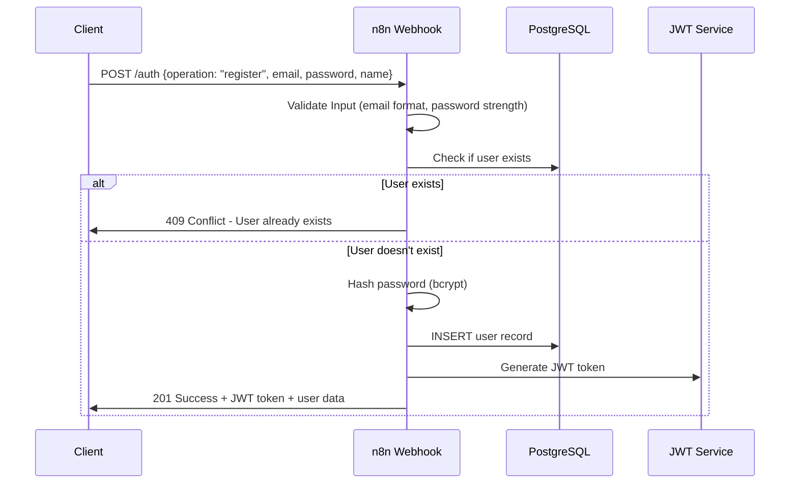
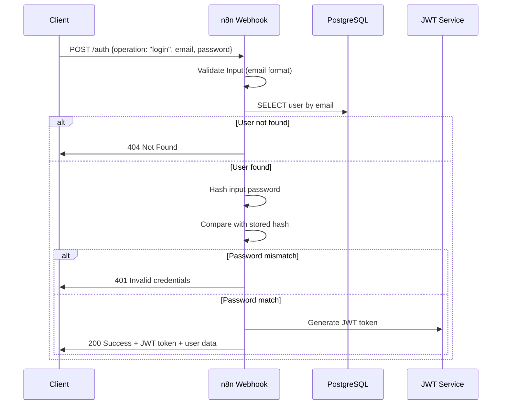
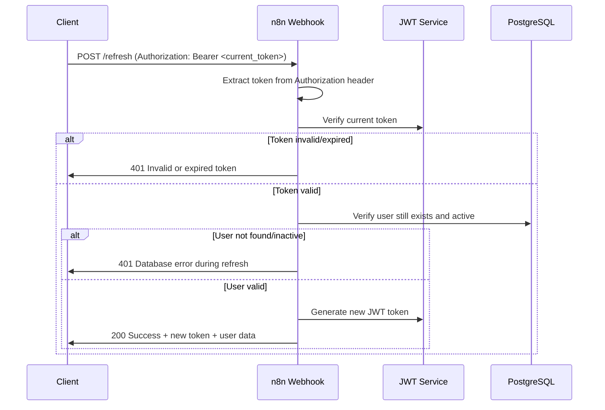
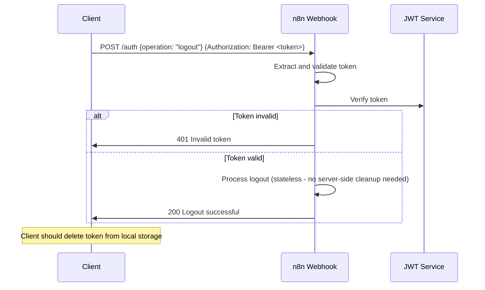

# Authentication & Authorization Documentation

This document details the authentication and authorization mechanisms implemented in FinGoal AI based on the n8n workflows.

## Authentication Flow

### JWT-Based Authentication
The system uses JSON Web Tokens (JWT) for stateless authentication with the following characteristics:

- **Token Expiration**: 24 hours for access tokens
- **Signing Algorithm**: HMAC SHA-256 (HS256)
- **Claims**: `userId`, `email`, `expiresIn`
- **Header Format**: `Authorization: Bearer <token>`

## Registration Flow

### 1. User Registration Process



### 2. Registration Validation Rules

#### Email Validation
- Must be valid email format (`/^[^\s@]+@[^\s@]+\.[^\s@]+$/`)
- Automatically converted to lowercase
- Trimmed of whitespace

#### Password Validation
- Minimum 8 characters
- Must contain at least one uppercase letter
- Must contain at least one lowercase letter  
- Must contain at least one number
- Regex: `/(?=.*[a-z])(?=.*[A-Z])(?=.*\d)/`

#### Name Validation
- Required field
- Trimmed of leading/trailing whitespace
- No specific format restrictions

### 3. Registration Implementation Details

```javascript
// Password Hashing (n8n Crypto Node)
const hashedPassword = crypto.hash(password, 'SHA256');

// User Creation Query
const createUserQuery = `
  INSERT INTO users (id, email, password_hash, name, created_at, is_active)
  VALUES (gen_random_uuid(), $1, $2, $3, NOW(), true)
  RETURNING id, email, name, created_at
`;

// JWT Generation Claims
const jwtClaims = {
  expiresIn: "24h",
  userId: user.id,
  email: user.email
};
```

## Login Flow

### 1. User Login Process



### 2. Login Implementation Details

```javascript
// User Lookup Query
const getUserQuery = `
  SELECT id, email, name, password_hash, created_at, is_active
  FROM users 
  WHERE email = $1 AND is_active = true
`;

// Password Verification
const inputPasswordHash = crypto.hash(inputPassword, 'SHA256');
const isValidPassword = (inputPasswordHash === storedPasswordHash);
```

## Token Refresh Flow

### 1. Token Refresh Process



### 2. Token Refresh Implementation

```javascript
// Token Extraction from Header
const authHeader = headers.authorization || headers.Authorization;
if (!authHeader || !authHeader.startsWith('Bearer ')) {
  return error('Invalid authorization format');
}
const token = authHeader.substring(7);

// User Verification Query
const verifyUserQuery = `
  SELECT id, email, name, created_at 
  FROM users 
  WHERE id = $1 AND email = $2 AND is_active = true
`;

// New Token Generation
const newTokenClaims = {
  expiresIn: "24h",
  userId: user.id,
  email: user.email
};
```

## Logout Flow

### 1. User Logout Process



## Authentication Middleware

### 1. Middleware Implementation

The authentication middleware is implemented as a separate n8n workflow that can be called by other workflows:

```javascript
// Middleware Workflow Logic
const extractToken = (headers) => {
  const authHeader = headers.authorization || headers.Authorization;
  if (!authHeader || !authHeader.startsWith('Bearer ')) {
    return null;
  }
  return authHeader.substring(7);
};

const verifyAndExtractUser = async (token) => {
  try {
    const decoded = jwt.verify(token);
    const user = await db.query('SELECT * FROM users WHERE id = $1 AND is_active = true', [decoded.userId]);
    return { success: true, user, jwtPayload: decoded };
  } catch (error) {
    return { success: false, error: 'Invalid or expired token' };
  }
};
```

### 2. Middleware Usage Pattern

```javascript
// In protected endpoints
const authResult = await executeWorkflow('auth-middleware', { headers });
if (!authResult.success) {
  return respondUnauthorized(authResult.error);
}

// Extract user context
const userId = authResult.jwtPayload.userId;
const userEmail = authResult.jwtPayload.email;
```

## Security Considerations

### 1. Token Security
- **Storage**: Tokens should be stored securely on client (secure HttpOnly cookies recommended)
- **Transmission**: Always use HTTPS in production
- **Expiration**: 24-hour expiration with refresh capability
- **Rotation**: New token generated on each refresh

### 2. Password Security
- **Hashing**: SHA-256 hashing (note: consider upgrading to bcrypt for production)
- **Strength**: Enforced password complexity rules
- **Storage**: Never store plain text passwords

### 3. Rate Limiting
- **Login Attempts**: 5 attempts per minute per IP
- **Registration**: 3 attempts per minute per IP  
- **Token Refresh**: 10 attempts per minute per user

### 4. Error Handling
- **Generic Errors**: Don't expose sensitive information
- **Timing Attacks**: Consistent response times for login attempts
- **Logging**: Log all authentication attempts for security monitoring

## Error Responses

### Common Authentication Errors

```json
{
  "success": false,
  "error": "Authentication required",
  "timestamp": "2025-09-21T10:30:00Z"
}
```

```json
{
  "success": false, 
  "error": "Invalid or expired token",
  "timestamp": "2025-09-21T10:30:00Z"
}
```

```json
{
  "success": false,
  "error": "Invalid email or password",
  "timestamp": "2025-09-21T10:30:00Z"
}
```

## Testing Authentication

### 1. Registration Test
```bash
curl -X POST http://localhost:5678/webhook/auth \
  -H "Content-Type: application/json" \
  -d '{
    "operation": "register",
    "email": "test@example.com",
    "password": "TestPass123",
    "name": "Test User"
  }'
```

### 2. Login Test
```bash
curl -X POST http://localhost:5678/webhook/auth \
  -H "Content-Type: application/json" \
  -d '{
    "operation": "login", 
    "email": "test@example.com",
    "password": "TestPass123"
  }'
```

### 3. Token Refresh Test
```bash
curl -X POST http://localhost:5678/webhook/refresh \
  -H "Authorization: Bearer <your_jwt_token>"
```

### 4. Protected Endpoint Test
```bash
curl -X GET http://localhost:5678/webhook/user/profile \
  -H "Authorization: Bearer <your_jwt_token>"
```

## Production Recommendations

### 1. Security Enhancements
- Implement bcrypt for password hashing instead of SHA-256
- Add CSRF protection for web clients
- Implement refresh token rotation
- Add device/session management
- Set up monitoring for suspicious authentication patterns

### 2. Performance Optimizations
- Cache JWT verification results
- Implement connection pooling for database
- Add Redis for session management if needed
- Monitor authentication endpoint performance

### 3. Compliance Considerations
- Implement proper audit logging
- Add GDPR compliance features (data export/deletion)
- Set up security headers (HSTS, CSP, etc.)
- Regular security vulnerability assessments
