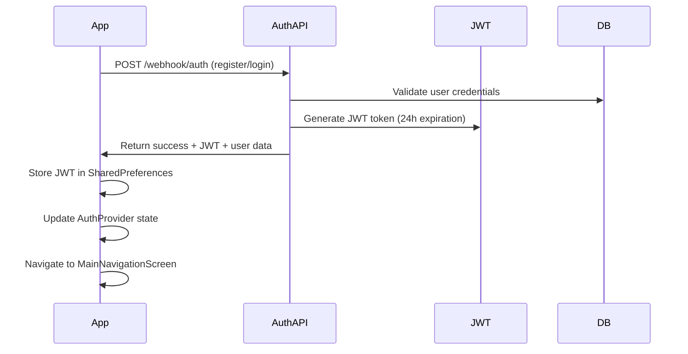
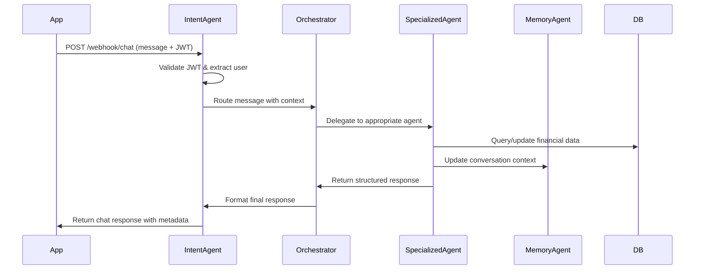
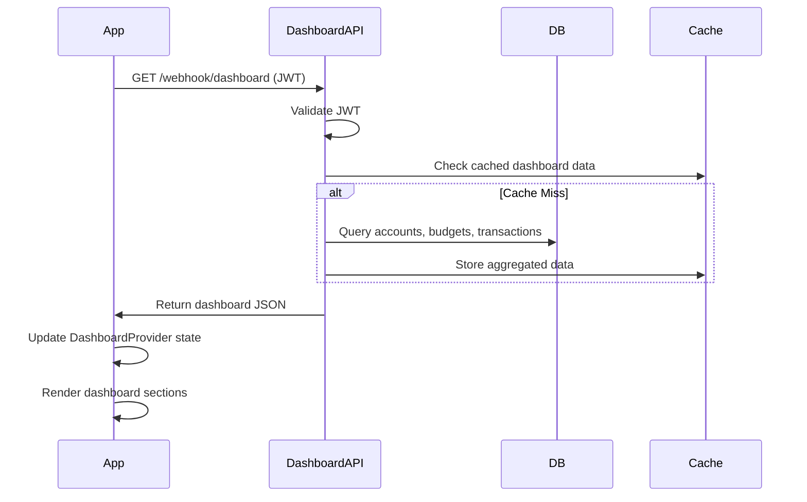
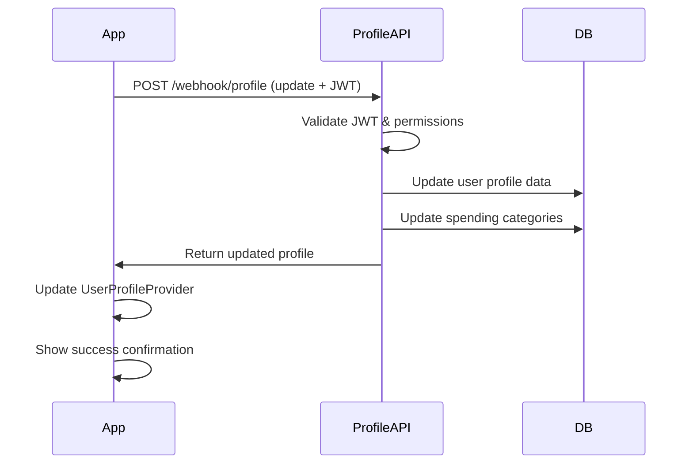
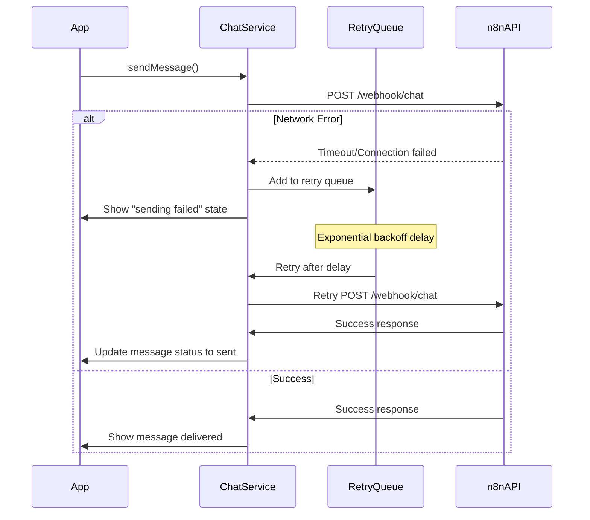

# Core Workflows

## Authentication Flow (Implemented)

## Multi-Agent Chat Flow (Implemented)

## Dashboard Data Flow (Implemented)

## Profile Management Flow (Implemented)

## Error Handling & Retry Flow (Implemented)

---
