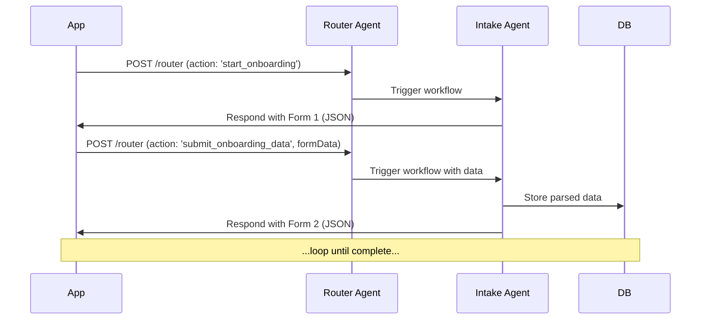

# Core Workflows

## User Onboarding Sequence

```mermaid
sequenceDiagram
    participant App
    participant Router Agent
    participant Intake Agent
    participant DB

    App->>Router Agent: POST /router (action: 'start_onboarding')
    Router Agent->>Intake Agent: Trigger workflow
    Intake Agent->>App: Respond with Form 1 (JSON)
    App->>Router Agent: POST /router (action: 'submit_onboarding_data', formData)
    Router Agent->>Intake Agent: Trigger workflow with data
    Intake Agent->>DB: Store parsed data
    Intake Agent->>App: Respond with Form 2 (JSON)
    Note over App, DB: ...loop until complete...
```

---
