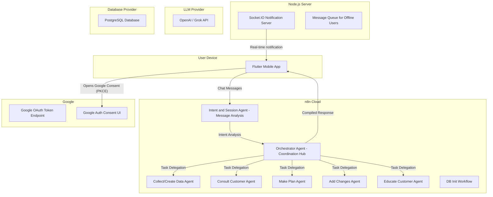

# High Level Architecture (Auth refactor: n8n handles Google OAuth)

## Technical Summary
n8n acts as the complete backend system, providing REST-like APIs through webhook endpoints for all mobile app interactions including authentication, chat messaging, dynamic form rendering, dashboard data, and notification triggers. The authentication flow works as follows:

- Mobile app initiates Google OAuth and receives authorization code
- Mobile app calls n8n login API with the authorization code
- n8n exchanges code with Google's OAuth endpoint, stores encrypted tokens in PostgreSQL
- n8n issues JWT session token to mobile app for subsequent API calls
- For token refresh, mobile app calls n8n refresh API, which handles Google token renewal

The system uses a specialized 7-agent AI architecture with dual-entry coordination: Intent and Session Agent handles message analysis and session management, while the Orchestrator Agent coordinates 5 specialized agents (Collect/Create Data, Consult Customer, Make Plan, Add Changes, Educate Customer), each with persistent memory stored in PostgreSQL. The architecture supports:

- **Chat Interface & Messaging**: Real-time communication with AI agents through a central Router Agent
- **Dynamic Form Rendering**: JSON-driven form generation for flexible data collection within chat conversations
- **Financial Dashboard**: Comprehensive data visualization with specialized Dashboard API
- **Real-time Notifications**: Standalone Node.js Socket.IO server for immediate alerts triggered by n8n workflows

User data is flexibly stored using JSONB schemas for complex financial information while maintaining structured tables for core entities.

## Platform and Infrastructure Choice
*   Platform: n8n Cloud + External PostgreSQL + Node.js Socket.IO Server
    *   Rationale: n8n serves as the complete backend, providing REST APIs via webhooks, orchestrating multi-agent AI workflows, and managing all data persistence. Node.js server handles real-time notifications.
*   Key Services:
    *   **n8n Cloud**: Workflow execution, webhook-based API endpoints, HTTP request nodes, scheduled monitoring, multi-agent orchestration, dynamic form generation
    *   **PostgreSQL**: Structured data storage (users, accounts, transactions) + flexible JSONB storage for complex financial data + agent memory system + form schemas
    *   **LLM Provider**: OpenAI/Gemini for AI agent interactions and natural language processing
    *   **Node.js Socket.IO Server**: Real-time notification delivery, user session management, offline message queuing
    *   **Flutter**: Cross-platform mobile app with dynamic form rendering, chat interface, dashboard visualization

## Auth Design Details
- Authentication Agent (n8n) responsibilities:
  - Exchange authorization code for tokens (POST to https://oauth2.googleapis.com/token).
  - Store access_token, refresh_token, expiry, token metadata in `users`/`auth_tokens` tables (encrypted).
  - Generate application session JWTs (short-lived) and optional refresh sessions.
  - Handle refresh flow: use refresh_token to obtain new access_token and update DB.
  - Support token revoke/cleanup and logging.
- Security:
  - Store OAuth client_id and client_secret as n8n credentials/env variables.
  - Use PKCE for mobile flows: Flutter obtains auth code with PKCE, sends code to Router Agent.
  - All n8n endpoints must be HTTPS, protected by API keys and rate limits.
  - Encrypt tokens at rest and restrict DB access.
- Client flow (recommended):
  1. Flutter initiates Google OAuth in external browser with PKCE, redirect URI points to a lightweight redirect handler (deep link) that returns an auth code.
  2. Flutter sends auth code to Router Agent /n8n-config webhook for "auth/exchange".
  3. n8n Authentication Agent exchanges code, stores tokens, returns app JWT to Flutter.
  4. When access_token expires, Flutter calls /auth/refresh; n8n uses stored refresh_token to refresh with Google and returns new app JWT.

## Repository Structure
*   Structure: Monorepo
    *   Rationale: Keeps Flutter app, n8n workflow exports, and future Socket.io server together.
    *   Package Organization: `/app` for Flutter, `/n8n-config` for exported workflows, `/server` for future Socket.io server, shared environment template.

## High Level Architecture Diagram

## Architectural Patterns
*   **7-Agent Architecture**: Dual-entry system with Intent and Session Agent + Orchestrator Agent coordinating 5 specialized agents (Collect/Create Data, Consult Customer, Make Plan, Add Changes, Educate Customer) with persistent memory and specific responsibilities
*   **Dual-Agent Gateway Pattern**: Intent and Session Agent handles message analysis and session management, while Orchestrator Agent coordinates task delegation and compiles responses
*   **Session State Management**: Persistent session continuity across all agents with shared memory systems
*   **Agent Workflow Coordination**: Orchestrated task delegation between specialized agents with compliance validation
*   **Dynamic Form Rendering**: JSON-schema driven form generation enabling flexible data collection within chat conversations
*   **Real-time Communication**: Socket.IO integration for immediate notification delivery and bidirectional communication
*   **Hybrid Data Storage**: Structured tables for core entities + flexible JSONB for complex financial schemas + session state management
*   **Memory-Driven Intelligence**: Each agent maintains contextual memories for consistent, personalized responses across conversations
*   **Serverless Workflows**: n8n orchestrates all external calls (Google OAuth, LLM, notification server, future bank APIs)
*   **Event-Driven Monitoring**: Scheduled workflows for goal tracking with real-time alert triggering
