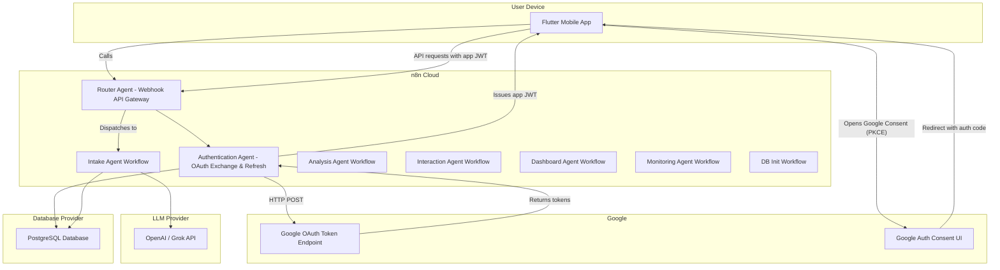

# High Level Architecture (Email/Password Authentication)

## Technical Summary
n8n acts as the complete backend system, providing REST-like APIs through webhook endpoints for all mobile app interactions including registration, login, token refresh, profile management, chat, and dashboard data. The authentication flow works as follows:

- Mobile app collects email/password credentials from user
- Mobile app calls n8n login API with email and password
- n8n verifies credentials against hashed passwords in PostgreSQL
- n8n issues JWT session token to mobile app for subsequent API calls
- For token refresh, mobile app calls n8n refresh API, which handles JWT token renewal

The system uses a multi-agent AI architecture with 9 specialized agents, each with persistent memory stored in PostgreSQL. User data is flexibly stored using JSONB schemas for complex financial information while maintaining structured tables for core entities.

## Platform and Infrastructure Choice
*   Platform: n8n Cloud + External PostgreSQL + Future Socket.io Server
    *   Rationale: n8n serves as the complete backend, providing REST APIs via webhooks, orchestrating multi-agent AI workflows, and managing all data persistence.
*   Key Services:
    *   n8n Cloud: Workflow execution, webhook-based API endpoints, HTTP request nodes, scheduled monitoring, multi-agent orchestration
    *   PostgreSQL: Structured data storage (users, accounts, transactions) + flexible JSONB storage for complex financial data + agent memory system
    *   LLM Provider: OpenAI/Grok for AI agent interactions
    *   Future: Node.js Socket.io server for real-time push notifications and bank integration alerts

## Auth Design Details
- Authentication Agent (n8n) responsibilities:
  - Handle user registration with email/password validation and secure password hashing.
  - Verify email/password credentials against hashed passwords in PostgreSQL.
  - Store user credentials, profile data, and session metadata in `users` table (encrypted).
  - Generate application session JWTs (short-lived) and optional refresh sessions.
  - Handle refresh flow: use refresh_token to obtain new JWT and update DB.
  - Support password reset, account lockout, and audit logging.
- Security:
  - Store JWT signing secrets and email service credentials as n8n credentials/env variables.
  - Use bcrypt or argon2 for secure password hashing with salt.
  - All n8n endpoints must be HTTPS, protected by API keys and rate limits.
  - Encrypt sensitive data at rest and restrict DB access.
- Client flow (recommended):
  1. Flutter collects email/password from user registration or login form.
  2. Flutter sends credentials to n8n /webhook/register or /webhook/login endpoint.
  3. n8n Authentication Agent verifies credentials, stores user data (registration) or validates (login), returns app JWT to Flutter.
  4. When JWT expires, Flutter calls /webhook/refresh; n8n uses stored refresh_token to issue new JWT.

## Repository Structure
*   Structure: Monorepo
    *   Rationale: Keeps Flutter app, n8n workflow exports, and future Socket.io server together.
    *   Package Organization: `/app` for Flutter, `/n8n-config` for exported workflows, `/server` for future Socket.io server, shared environment template.

## High Level Architecture Diagram

## Architectural Patterns
*   Multi-Agent Architecture: 9 specialized AI agents with persistent memory and specific responsibilities
*   API Gateway Pattern: Router AI centralizes all mobile app requests and routes to appropriate agents
*   Hybrid Data Storage: Structured tables for core entities + flexible JSONB for complex financial schemas
*   Memory-Driven Intelligence: Each agent maintains 5-7 relevant memories for context-aware responses
*   Serverless Workflows: n8n orchestrates all external calls (Google OAuth, LLM, future bank APIs)
*   Event-Driven Monitoring: Scheduled workflows for goal tracking and real-time alerts
