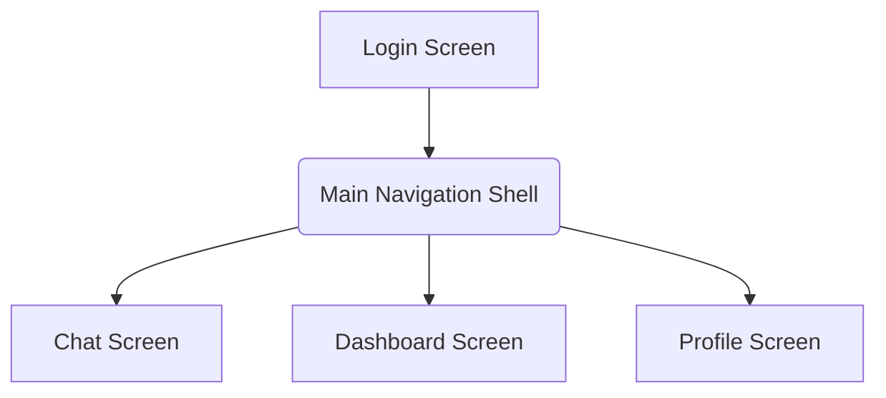
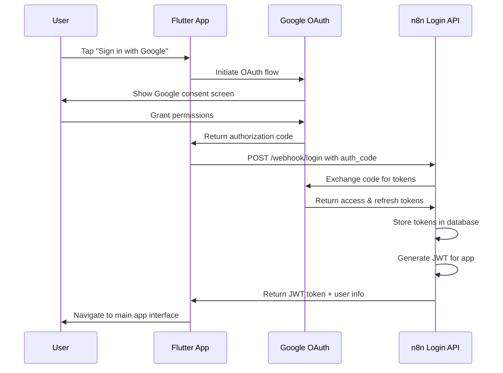
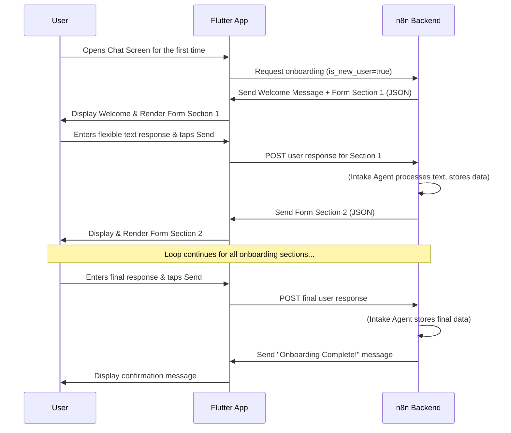
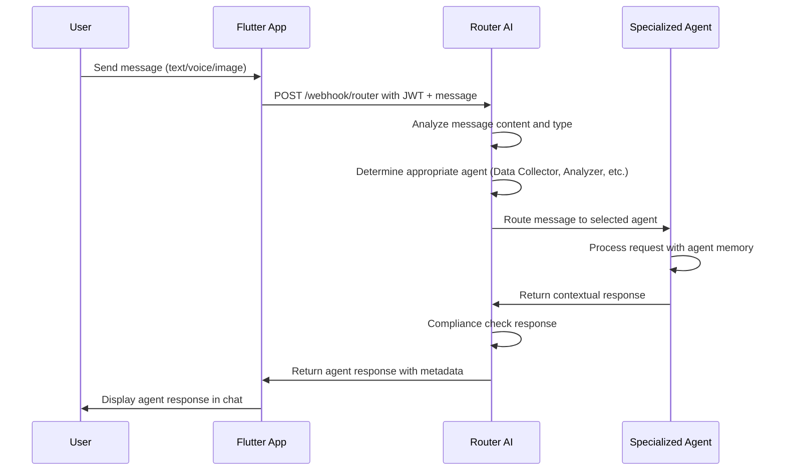
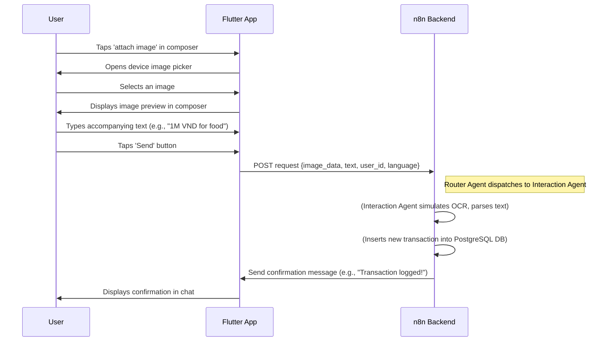
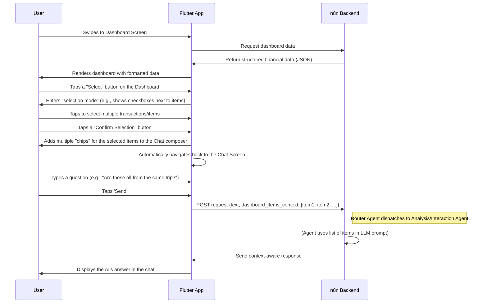

# **FinGoal AI UI/UX Specification**

## Introduction
This document defines the user experience goals, information architecture, user flows, and visual design specifications for FinGoal AI's user interface. It serves as the foundation for visual design and frontend development, ensuring a cohesive and user-centered experience.

The frontend integrates with a sophisticated multi-agent AI backend through n8n workflows, requiring specialized handling for Google OAuth authentication, JWT tokens, and contextual agent responses.

### Architecture Integration
*   **Authentication:** Google OAuth via n8n Login API with JWT token management
*   **Backend Communication:** RESTful APIs through n8n webhooks with specialized agent routing
*   **Multi-Agent Responses:** Dynamic UI adaptation based on different AI agent response types
*   **Real-time Features:** Prepared for Socket.io integration for future push notifications

### Overall UX Goals & Principles

#### Target User Personas
*   **The Financially Fragmented Professional:** Vietnamese professionals and small business owners (25-45) who are tech-savvy but have low engagement with PFM tools. They feel overwhelmed by their fragmented finances and need a simple, trustworthy, and unified solution to help them achieve major life goals.

#### Usability Goals
*   **Effortless Onboarding:** New users should be able to complete the initial data input process in under 5 minutes, feeling guided and supported throughout.
*   **Low Cognitive Load:** The interface must be simple and uncluttered. Information should be presented in easily digestible chunks to avoid overwhelming the user.
*   **High Efficiency:** Once onboarded, users should be able to perform common tasks (like logging a transaction) with minimal taps and cognitive effort.
*   **High Learnability:** The conversational nature of the app should make it immediately intuitive, with no complex features to learn.

#### Design Principles
1.  **Clarity Above All:** Prioritize clear, simple language and clean visual presentation. Avoid financial jargon. The user must always understand what's happening and what they need to do next to build trust.
2.  **Conversational, Not Clinical:** The entire experience should feel like a supportive chat with a smart, friendly advisor, not like filling out a sterile financial form.
3.  **Guidance, Not Just Data:** The app should do more than just display numbers. Every piece of information should be contextualized, and the AI should proactively offer insights and educational tips.
4.  **Progressive Disclosure:** Reveal information and complexity only when necessary. Start simple and provide paths to more detailed information, preventing the user from feeling overwhelmed upfront.

## Information Architecture (IA)

### Site Map / Screen Inventory
This diagram shows the primary screens and their relationship to one another.

### Navigation Structure
*   **Primary Navigation:** The core navigation is a horizontal `PageView` (or similar widget) allowing the user to swipe left and right between the **Chat Screen** and the **Dashboard Screen**. Visual indicators (like tabs or a segmented control) will show the user which of the two main views is currently active.
*   **Profile Access:** The **Profile Screen** will be accessed via an icon button located in a persistent `AppBar` at the top of the Main Navigation Shell.
*   **Breadcrumb Strategy:** Not applicable for this flat mobile app structure.

## User Flows

### Google OAuth Authentication Flow

**User Goal:** To securely authenticate with Google and access the AI financial advisor.

**Entry Points:** App launch or when JWT token expires.

**Success Criteria:** User successfully authenticates via Google OAuth and receives a valid JWT token for API access.

**Flow Diagram:**

### Multi-Agent Chat Interaction Flow

**User Goal:** To interact with specialized AI agents for financial advice and data management.

**Entry Points:** Main chat interface after authentication.

**Success Criteria:** User receives contextually appropriate responses from the right AI agent based on their input.

**Flow Diagram:**

**Edge Cases & Error Handling:**
*   **Unparseable User Input:** If the Intake Agent cannot understand the user's free-form text, it should respond by asking for clarification (e.g., "I'm sorry, I didn't quite understand that. Could you try rephrasing?").
*   **User Skips a Section:** The user might not want to provide certain information. The AI should handle this gracefully, perhaps by saying, "No problem, you can always add this information later from your profile."
*   **Network Error:** If the app fails to send data to the backend, it should display an error message in the chat and provide a "Tap to retry" option.

### Multi-Agent Chat Interaction Flow  

**User Goal:** To interact with specialized AI agents for financial advice and data management.

**Entry Points:** Main chat interface after authentication.

**Success Criteria:** User receives contextually appropriate responses from the right AI agent based on their input.

**Flow Diagram:**

**Edge Cases & Error Handling:**
*   **Agent Routing Error:** If Router AI cannot determine appropriate agent, default to Data Collector AI with explanation request.
*   **Agent Memory Issues:** If agent memory is corrupted, gracefully degrade to stateless response with notification to Memory Updater AI.
*   **Compliance Check Failure:** If response fails compliance check, return generic safe response with error logged.
*   **JWT Token Expired:** If authentication fails, redirect to login flow and preserve message for retry after auth.

### Transaction Logging via Image Upload

**User Goal:** To quickly and easily log a new expense by uploading a picture of a receipt and adding a simple text description.

**Entry Points:** The flow begins from the Chat Screen's message composer.

**Success Criteria:** The user successfully uploads an image, adds a text note, sends the message, and receives a confirmation from the AI that the transaction has been correctly logged.

**Flow Diagram:**

**Edge Cases & Error Handling:**
*   **Missing Text Context:** If the user uploads an image without any accompanying text, the Interaction Agent should prompt for more information: "Thanks for the image! Could you please tell me the amount and category for this transaction?"
*   **Unparseable Text:** If the user's text doesn't contain the necessary details (e.g., amount), the agent should ask for clarification: "I see the receipt, but I couldn't determine the amount. Could you please provide it?"
*   **Invalid Image File:** The Flutter app should perform client-side validation to ensure the selected file is a valid image type before uploading.
*   **Upload Failure:** If the image upload fails due to a network issue, the app should display an error message and a "Tap to retry" option on the message.

### Viewing the Dashboard & Dashboard-to-Chat Interaction (Revised)

**User Goal:** To view a summary of my financial data, select one or more items I'm curious about, and then ask a specific question about them in the chat.

**Entry Points:** The flow begins from the Main Navigation Shell (either the Chat or Dashboard screen).

**Success Criteria:** The user successfully loads the dashboard, enters "selection mode," selects multiple items, confirms their selection, and sees them added to the chat composer, ready for them to ask a question.

**Flow Diagram:**

**Edge Cases & Error Handling:**
*   **Data Load Failure:** If the dashboard data fails to load, the screen should display an error message with a "Retry" button.
*   **No Data to Display:** If there is no data, the "Select" button should be disabled or hidden.
*   **Canceling Selection:** The user must have a clear way to exit "selection mode" without adding any items to the chat (e.g., a "Cancel" button).

## Wireframes & Mockups

**Primary Design Files:** All visual design and development will be based on the descriptive wireframes below. No external design files (e.g., Figma, Sketch) will be used for the MVP.

### Key Screen Layouts

**1. Login Screen (Google OAuth)**
*   **Purpose:** To provide secure Google OAuth authentication integrated with n8n backend.
*   **Layout:** Centered vertically and horizontally on the screen.
*   **Key Elements:**
    *   `App Logo`: FinGoal AI branding at the top.
    *   `Welcome Message`: "Secure financial guidance powered by AI" 
    *   **`Sign in with Google Button`**: Official Google Sign-In button that initiates OAuth flow in external browser.
    *   `Loading State`: Shows progress during authentication and JWT token exchange.
    *   `Error Handling`: Displays authentication errors with retry option.
*   **Authentication Flow:** Google OAuth → Authorization Code → n8n Login API → JWT Token → Main App

**2. Main Navigation Shell**
*   **Purpose:** To host the primary Chat and Dashboard views and allow seamless navigation between them.
*   **Layout:** A persistent `AppBar` at the top, and a `PageView` or `TabBarView` occupying the rest of the screen.
*   **Key Elements:**
    *   `AppBar`: Contains the app title, "FinGoal AI," and an icon button to navigate to the Profile Screen.
    *   `PageView`: Contains the Chat Screen and the Dashboard Screen.
    *   `Navigation Indicator`: A `TabBar` or similar widget to indicate the active page.

**3. Chat Screen**
*   **Purpose:** To serve as the primary conversational interface for all user interactions.
*   **Layout:** A classic messaging app layout.
*   **Key Elements:**
    *   `Message List`: A vertically scrolling list of chat bubbles.
    *   `Message Composer`: A fixed area at the bottom with buttons for attaching images, voice input, and sending, plus a text input field.
    *   `Rich Content Area`: A space within the composer to display previews of attached content.

**4. Dashboard Screen**
*   **Purpose:** To provide a clear, read-only summary of the user's financial health.
*   **Layout:** A vertically scrolling view.
*   **Key Elements:**
    *   `AppBar Buttons`: "Select" and "Reload" buttons.
    *   `Dashboard Sections`: A series of distinct visual cards for "Money Accounts," "Budgets," "Recent Transactions," etc.

**5. Profile Screen**
*   **Purpose:** To allow the user to manage their profile and spending categories.
*   **Layout:** A simple, vertically scrolling list of settings.
*   **Key Elements:**
    *   `AppBar`: With a "Back" button and title.
    *   `User Info Section`: Displays user's name/email (now populated from Google Sign-In).
    *   `Language Switcher`: A UI element to switch between English and Vietnamese.
    *   `Spending Categories Section`: An editable list of categories with an "Add New" button.

## Component Library / Design System

**Design System Approach:**
For the FinGoal AI MVP, we will **not** create a custom design system. Instead, we will adopt an existing component library to ensure rapid development and a polished, consistent UI.

**Recommended Library:** **Material 3** (the latest version of Google's Material Design system, which is the default for modern Flutter development).

**Rationale:**
*   **Speed:** Material 3 provides a vast collection of pre-built, production-ready widgets (buttons, text fields, cards, navigation bars, etc.) that can be used out of the box.
*   **Quality & Consistency:** It's a well-designed, professional system that ensures our app will look and feel modern and cohesive without significant design effort.
*   **Customization:** It's highly customizable. We can easily configure a color scheme and typography to match our brand identity.
*   **Best Practices:** It has excellent support for accessibility and platform-specific adaptations (e.g., how elements look on iOS vs. Android).

**Core Components to be used:**
Below is a list of the primary Material 3 components we will use to build the screens defined in our wireframes.

*   **Buttons:** `ElevatedButton`, `TextButton`, `IconButton` (for AppBar icons, composer actions).
*   **Input & Selections:** `TextField` (for chat input), `Checkbox` (for dashboard selection mode).
*   **Navigation:** `AppBar`, `TabBar`, `PageView`, `BottomNavigationBar` (as an alternative to the TabBar).
*   **Containment & Layout:** `Card` (for dashboard sections), `ListView` (for chat and lists), `Scaffold` (for basic screen layout).
*   **Feedback & Status:** `CircularProgressIndicator` (for loading states), `Dialog` (for confirmations or errors).
*   **Typography:** We will use the default Material 3 type scale, customized with our chosen font.
*   **Icons:** We will use the built-in `material-icons` library.

## Branding & Style Guide

### Visual Identity
As there is no pre-existing brand guide, we will establish a simple and clean visual identity for FinGoal AI centered on professionalism, trust, and clarity. The following elements will serve as our guide.

### Color Palette
The palette is designed to be calm and professional, using a trustworthy blue as the primary color and a vibrant green to signify growth and positive actions.

| Color Type | Hex Code    | Usage                                           |
| :--------- | :---------- | :---------------------------------------------- |
| Primary    | `#0052FF`   | Primary buttons, links, active states, key highlights |
| Secondary  | `#00C48C`   | Accents, success states, positive indicators      |
| Warning    | `#FFAA00`   | Cautions, important notices, pending states     |
| Error      | `#FF4D4F`   | Errors, destructive action confirmations        |
| Neutral-900| `#1C2024`   | Primary text, headings                          |
| Neutral-700| `#5A6470`   | Secondary text, subtitles, disabled text        |
| Neutral-200| `#EAECEF`   | Borders, dividers                               |
| Neutral-100| `#F5F6F7`   | Screen backgrounds, card backgrounds            |

### Typography

*   **Primary Font Family:** **Poppins** (A clean, modern, and friendly sans-serif font available from Google Fonts. It has great readability on mobile screens).
*   **Monospace Font Family:** `Roboto Mono` (For any potential display of structured data).

**Type Scale**

| Element | Size   | Weight   | Line Height |
| :------ | :----- | :------- | :---------- |
| H1      | 24pt   | Bold     | 1.2         |
| H2      | 20pt   | Semi-Bold| 1.3         |
| H3      | 18pt   | Medium   | 1.4         |
| Body    | 16pt   | Regular  | 1.5         |
| Small   | 14pt   | Regular  | 1.5         |

### Iconography
*   **Icon Library:** We will use the standard **Material Symbols** library (the latest icon set for Material 3).
*   **Usage Guidelines:** Icons should be used consistently and primarily for actions in the `AppBar` and message composer. They should always have clear, universally understood meanings.

### Spacing & Layout
*   **Grid System:** All layouts will be based on an **8-point grid system**. This means all spacing, padding, and margins will be in multiples of 8 (e.g., 8px, 16px, 24px).
*   **Spacing Scale:**
    *   Small: 8px
    *   Medium: 16px
    *   Large: 24px
    *   X-Large: 32px

## Accessibility Requirements

**Compliance Target:**
*   **Standard:** WCAG 2.1 Level AA. While full compliance is a post-MVP goal, all development will adhere to AA principles from the start to build a strong foundation.

**Key Requirements:**
*   **Visual:**
    *   **Color Contrast:** All text and meaningful UI elements will meet a minimum contrast ratio of 4.5:1 against their background.
    *   **Focus Indicators:** All interactive elements (buttons, inputs) must have a clear and visible focus state for keyboard/switch control users.
*   **Interaction:**
    *   **Touch Targets:** All interactive elements will have a minimum touch target size of 44x44 points.
    *   **Screen Reader Support:** All UI elements will have appropriate semantic labels. Dynamic content updates in the chat will be announced to screen readers.
*   **Content:**
    *   **Form Labels:** All inputs within the dynamically rendered forms will be programmatically associated with a clear label.
    *   **Heading Structure:** Screens will use a logical heading structure to facilitate navigation.

---

## Responsiveness Strategy

**Breakpoints:**
While the primary target is mobile, the app should be reasonably usable on tablets.
| Breakpoint | Min Width | Target Devices |
| :--- | :--- | :--- |
| Mobile | 0px | Standard smartphones |
| Tablet | 600px | Small to large tablets |

**Adaptation Patterns:**
*   **Layout Changes:** On tablets, the layout will expand, utilizing more whitespace. The chat interface will remain single-column, but dashboard cards may reflow into a two-column grid if space permits.
*   **Content Priority:** All content is considered essential; no content will be hidden on smaller screens. The focus is on adapting the layout, not removing functionality.

---

## Animation & Micro-interactions

**Motion Principles:**
Animations will be purposeful and minimal, aiming to guide the user and provide feedback without being distracting. We will primarily use the default, high-quality animations provided by the Material 3 component library.

**Key Animations:**
*   **Screen Transitions:** Standard platform-aware transitions (e.g., slide-in) will be used for navigating between the Login, Main, and Profile screens.
*   **New Message Arrival:** New chat messages (both from the user and the AI) will gently fade and slide into the list to draw the eye.
*   **Button Taps:** All interactive elements will have a subtle ripple effect on tap, providing clear visual feedback, as is standard in Material 3.

---

## Performance Considerations

**Performance Goals:**
*   **App Startup:** The application should launch to the login screen in under 2 seconds.
*   **Interaction Response:** The UI must respond to user taps and gestures instantly (<100ms).
*   **Async Loading:** Loading indicators for backend calls should appear immediately, with a maximum timeout of 15 seconds before displaying an error.

**Design Strategies:**
*   **Virtual Lists:** The chat and transaction lists will use `ListView.builder` to ensure they perform efficiently even with hundreds of items.
*   **Asset Optimization:** Any images or icons included in the app bundle will be compressed and optimized.
*   **Minimal Rerenders:** Flutter state management will be implemented to avoid unnecessary widget rebuilds.

